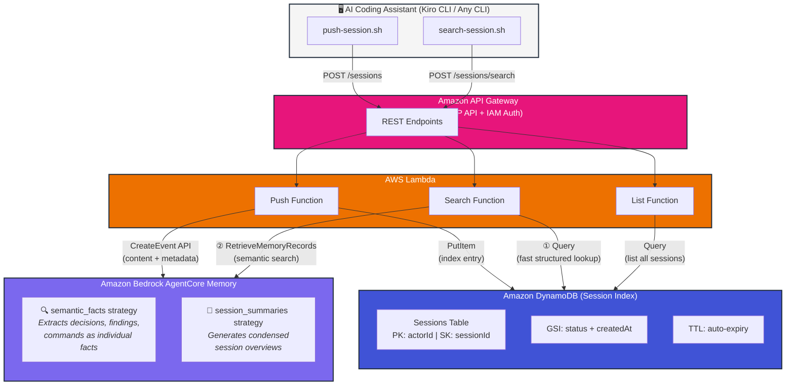
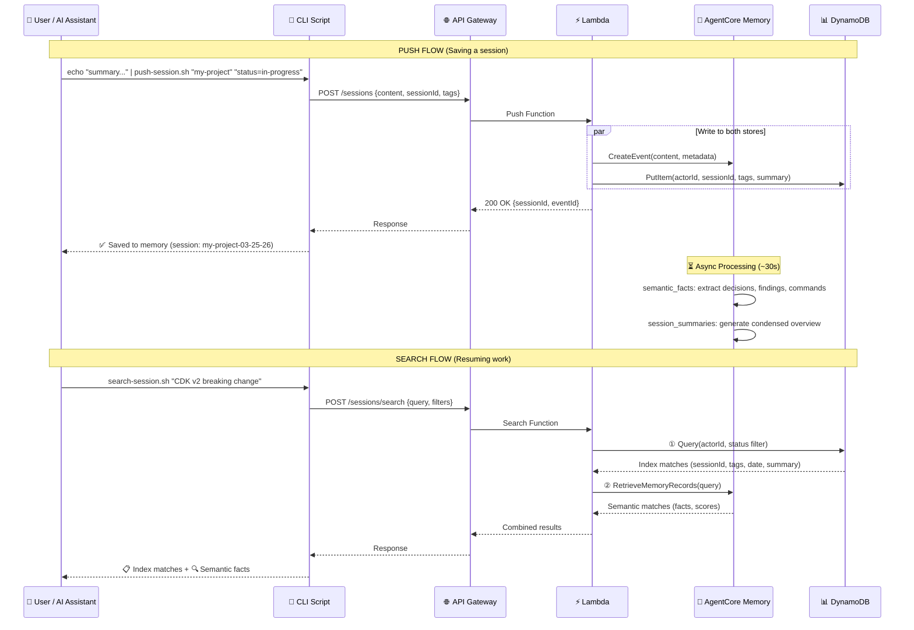

# Architecture Diagram — Mermaid (renders in GitHub, Quip, most blog platforms)

```mermaid
flowchart TB
    subgraph CLIENT["🖥️ AI Coding Assistant (Kiro CLI / Any CLI)"]
        push_script["push-session.sh"]
        search_script["search-session.sh"]
    end

    subgraph APIGW["Amazon API Gateway<br/>(HTTP API + IAM Auth)"]
        endpoint["REST Endpoints"]
    end

    subgraph LAMBDA["AWS Lambda"]
        push_fn["Push Function"]
        search_fn["Search Function"]
        list_fn["List Function"]
    end

    subgraph MEMORY["Amazon Bedrock AgentCore Memory"]
        direction TB
        semantic["🔍 semantic_facts strategy<br/><i>Extracts decisions, findings,<br/>commands as individual facts</i>"]
        summary["📝 session_summaries strategy<br/><i>Generates condensed<br/>session overviews</i>"]
    end

    subgraph DDB["Amazon DynamoDB (Session Index)"]
        direction TB
        table["Sessions Table<br/>PK: actorId | SK: sessionId"]
        gsi["GSI: status + createdAt"]
        ttl["TTL: auto-expiry"]
    end

    push_script -->|"POST /sessions"| endpoint
    search_script -->|"POST /sessions/search"| endpoint

    endpoint --> push_fn
    endpoint --> search_fn
    endpoint --> list_fn

    push_fn -->|"CreateEvent API<br/>(content + metadata)"| MEMORY
    push_fn -->|"PutItem<br/>(index entry)"| DDB

    search_fn -->|"① Query<br/>(fast structured lookup)"| DDB
    search_fn -->|"② RetrieveMemoryRecords<br/>(semantic search)"| MEMORY

    list_fn -->|"Query<br/>(list all sessions)"| DDB

    style CLIENT fill:#f5f5f5,stroke:#232F3E,stroke-width:2px
    style APIGW fill:#E7157B,stroke:#232F3E,stroke-width:2px,color:#fff
    style LAMBDA fill:#ED7100,stroke:#232F3E,stroke-width:2px,color:#fff
    style MEMORY fill:#7B68EE,stroke:#232F3E,stroke-width:2px,color:#fff
    style DDB fill:#4053D6,stroke:#232F3E,stroke-width:2px,color:#fff
```

# Push & Search Flow — Mermaid Sequence Diagram

```mermaid
sequenceDiagram
    participant User as 👤 User / AI Assistant
    participant Script as 📜 CLI Script
    participant API as 🌐 API Gateway
    participant Lambda as ⚡ Lambda
    participant Memory as 🧠 AgentCore Memory
    participant DDB as 📊 DynamoDB

    Note over User,DDB: PUSH FLOW (Saving a session)

    User->>Script: echo "summary..." | push-session.sh "my-project" "status=in-progress"
    Script->>API: POST /sessions {content, sessionId, tags}
    API->>Lambda: Push Function
    
    par Write to both stores
        Lambda->>Memory: CreateEvent(content, metadata)
        Lambda->>DDB: PutItem(actorId, sessionId, tags, summary)
    end
    
    Lambda-->>API: 200 OK {sessionId, eventId}
    API-->>Script: Response
    Script-->>User: ✅ Saved to memory (session: my-project-03-25-26)

    Note over Memory: ⏳ Async Processing (~30s)
    Memory->>Memory: semantic_facts: extract decisions, findings, commands
    Memory->>Memory: session_summaries: generate condensed overview

    Note over User,DDB: SEARCH FLOW (Resuming work)

    User->>Script: search-session.sh "CDK v2 breaking change"
    Script->>API: POST /sessions/search {query, filters}
    API->>Lambda: Search Function
    
    Lambda->>DDB: ① Query(actorId, status filter)
    DDB-->>Lambda: Index matches (sessionId, tags, date, summary)
    
    Lambda->>Memory: ② RetrieveMemoryRecords(query)
    Memory-->>Lambda: Semantic matches (facts, scores)
    
    Lambda-->>API: Combined results
    API-->>Script: Response
    Script-->>User: 📋 Index matches + 🔍 Semantic facts
```
